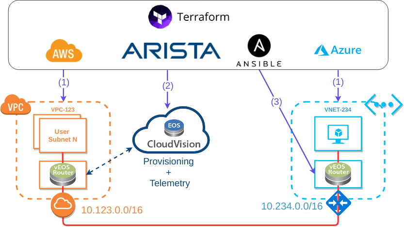

# Hybrid cloud multi-vendor orchestration with Terraform and Cloudvision Portal

Current repo contains a demo code to setup the following topology



The purpose of this demo is twofold:

* To showcase vEOS hybrid cloud end-to-end service orchestration 
* To demonstrate Arista-specific and vendor-neutral device provisioning models

The first objective is accomplished by building the following components:

* On **AWS** - a VPC with vEOS and an arbitrary number of subnets to host user VMs.
* On **Azure** - a VNET with vEOS and a single subnet with a test VM.

The second objective is accomplished by Terraform-driven orchestration of:

* **CVP** - AWS-based vEOS is added as a device, its config is reconciled and all the necessary IPsec-related configlets are pushed to the device
* **Ansible** - simply pushes an IPsec-related config with the aim being to demonstrate multi-vendor capabilities of both Terraform and Ansible.

Note that all components are provisioned from scratch to orchestrate end-to-end service between user VMs in AWS user subnets and a test VM in Azure test subnet.

# 0. Installation

Install [Terraform](https://www.terraform.io/intro/getting-started/install.html), [Ansible](https://docs.ansible.com/ansible/latest/installation_guide/intro_installation.html), [git](https://git-scm.com/book/en/v2/Getting-Started-Installing-Git) and [Go](https://golang.org/doc/install).

Clone the current git repo:

```
git clone https://github.com/networkop/tf-mcloud-demo.git; cd tf-mcloud-demo
```

# 1. Authentication

Terraform requires authenticaion details with enough privileges to create and delete VPC/VNET, Subnets and Virtual Machine objects on Azure, AWS and Arista CVP. At a minimum, the following environment variables must be set:

```bash
export TF_VAR_ipsec_license="URL of vEOS ipsec license"
export TF_VAR_veos_license="URL of vEOS license"
export TF_VAR_ipsec_psk="IPsec pre-shared key"
export TF_VAR_pub_ssh_key="public ssh key"
export TF_VAR_admin_username="vEOS admin username"
export TF_VAR_admin_password="vEOS admin password"

export ARM_SUBSCRIPTION_ID="Azure subscription ID"
export ARM_CLIENT_ID="Azure client ID"
export ARM_CLIENT_SECRET="Azure client secret"
export ARM_TENANT_ID="Azure tenant ID"
export TF_VAR_azure_rg="Existing Azure resource group"


export AWS_ACCESS_KEY_ID="AWS access key"
export AWS_SECRET_ACCESS_KEY="AWS secret key"
export AWS_DEFAULT_REGION="us-east-2"

export CVP_ADDRESS="CVP IP address"
export CVP_USER="CVP admin username"
export CVP_PWD="CVP admin password"
```

Note that this shows only one way of providing credentials. [Other methods](https://www.terraform.io/intro/getting-started/variables.html) are available, including more secure and re-usable [options](https://www.terraform.io/docs/state/sensitive-data.html).

# 2. Input parameters

In addition to authenctication details, the following variables must be defined in `terraform.tfvars`:

* **aws_cidr** - RFC1918 prefix to assign to AWS VPC
* **azure_cidr** - RFC1918 prefix to assign to Azure VNET
* **aws_asn** - BGP ASN to be assigned to vEOS in AWS
* **azure_asn** - BGP ASN to be assigned to vEOS in Azure
* **aws_tunnel_ip** - IPsec tunnel IP to be assigned to vEOS in AWS
* **azure_tunnel_ip** - IPsec tunnel IP to be assigned to vEOS in Azure
* **aws_user_subnets** - a list of user subnets to create inside AWS VPC

Some of the variables like default VM user, Azure location, VM sizes and version of vEOS are hard-coded into modules for the sake of simplicity and brevity. It is up to the user of Terraform to decide which variables to expose and which to hide.

# 3. Building the Terraform CVP plugin

In order to manage the Cloudvision Portal, Terraform requires a custom-built plugin. The following command will build the plugin, assuming that the operating system is Linux x86_64

```
go get -u github.com/networkop/cvpgo
go get -u github.com/networkop/terraform-cvp
go build -o terraform.d/plugins/linux_amd64/terraform-provider-cvp github.com/networkop/terraform-cvp
```

To build it for MacOS replace the last command with

```
go build -o terraform.d/plugins/darwin_amd64/terraform-provider-cvp github.com/networkop/terraform-cvp
```

# 4. Initialising Terraform

This step will ensure that all plugins required by the code are available locally and if necessary download them:

```
terraform init
```

# 5. Building the demo


```
terraform apply
```

# 6. Verification

Use values provided by the `terraform output` command to login and verify the end-to-end connectivity. The steps and values below are just an example:

```
Outputs:

aws_user_public_ips = 
centos@18.218.48.142
centos@18.188.226.120
aws_user_subnets = [
    10.123.1.0/24,
    10.123.2.0/24
]
aws_veos = ec2-user@18.222.3.208
azure_test_vm = ec2-user@51.140.9.16
azure_user_subnets = 10.234.1.0/24
azure_veos = ec2-user@51.140.6.115
veos_password = AristaAdmin12345
veos_username = cvpadmin
```

Now let's see what private IP was assigned to Azure test vm:

```
ssh ec2-user@51.140.14.162
$ ssh ec2-user@51.140.9.16
[ec2-user@MCLOUD-AZURE-TEST ~]$ ip a | grep inet
    inet 127.0.0.1/8 scope host lo
    inet6 ::1/128 scope host 
    inet 10.234.1.4/24 brd 10.234.1.255 scope global eth0
```

Now we can verify connectivity to it from either one of the AWS subnets:

```
$ ssh centos@18.218.48.142
[centos@ip-10-123-1-44 ~]$ ip a | grep inet
    inet 127.0.0.1/8 scope host lo
    inet 10.123.1.44/24 brd 10.123.1.255 scope global dynamic eth0
[centos@ip-10-123-1-44 ~]$ ping 10.234.1.4
PING 10.234.1.4 (10.234.1.4) 56(84) bytes of data.
4 bytes from 10.234.1.4: icmp_seq=1 ttl=62 time=86.1 ms
64 bytes from 10.234.1.4: icmp_seq=2 ttl=62 time=85.9 ms
^C
--- 10.234.1.4 ping statistics ---
2 packets transmitted, 2 received, 0% packet loss, time 1001ms
rtt min/avg/max/mdev = 85.961/86.072/86.183/0.111 ms
```

# 7. Destroying the demo

```
TF_WARN_OUTPUT_ERRORS=1 terraform destroy
```

# Graph of dependencies


